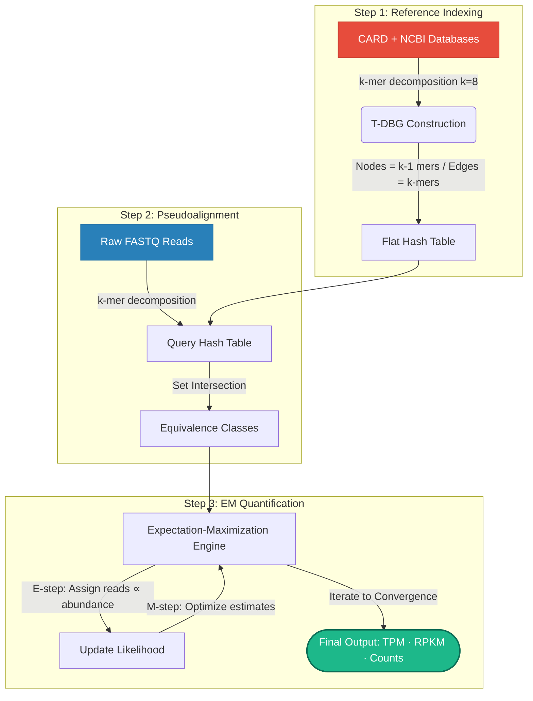

<div align="center">


<br/>

[](https://python.org)
[](#)
[](#)
[](#)

[](#)
[](#)
[](#)
[](#)

> **Bridging the gap between genomic AMR detection and functional resistance expression — without a single BAM file.**

[Features](#-key-features) • [Workflow](#-how-it-works) • [Quick Start](#-quick-start) • [Benchmarks](#-results) • [Citation](#-citation)

</div>

---

## 🌍 The Core Problem

Traditional AMR workflows face major bottlenecks:
* **Culture Assays:** Take 24–72 hours and miss non-culturable organisms.
* **WGS Pipelines:** Detect gene **presence**, not active **expression**.
* **Standard RNA-seq:** Generates massive, multi-gigabyte BAM files and runs slowly.

**AMR Analyser** uses pseudoalignment to rapidly capture and quantify only **transcriptionally active** AMR genes—delivering insights faster and leaner than alignment-based alternatives.

---

## ⚡ Key Features

| Feature | Standard Alignment (Bowtie2 / HISAT2) | AMR Analyser |
| :--- | :---: | :---: |
| **Speed** | ~200K reads/min | **~1.2M reads/min** |
| **Storage Overhead** | ⚠️ GBs of BAM files | **❌ None** |
| **Multi-map Resolution** | Limited / Naive | **✅ EM Algorithm** |
| **Functional AMR Only** | ❌ | **✅ Yes** |
| **Output Metrics** | Raw Counts | **✅ TPM, RPKM, Counts** |
| **Real-time Compatibility**| ❌ | **✅ Yes** |

---

## 🔬 How It Works

Here is the underlying algorithmic workflow pipeline, leveraging a native GitHub Mermaid diagram for clean rendering:



### Architectural Breakdown

1. **Reference Indexing:** Deconstructs CARD and NCBI databases into k-mer nodes (**k=8**) to construct a Transcript-De Bruijn Graph (T-DBG), storing it in a flat hash table for **O(1)** lookups.
2. **Pseudoalignment:** Decomposes raw FASTQ reads into k-mers, queries the index, and computes set intersections to place reads into high-confidence **Equivalence Classes**.
3. **EM Quantification:** Runs an **Expectation-Maximization (EM)** algorithm to iteratively distribute multi-mapped reads proportional to transcript abundance until convergence.

---

## 🚀 Quick Start

### 1. Installation
```bash
# Clone the repository
git clone https://github.com/ankushrouth/AMR-Analyser.git && cd AMR-Analyser

# Install dependencies (Python ≥ 3.8, Linux, 4-8 GB RAM recommended)
pip install -r requirements.txt
```

### 2. Execution Workflow
```bash
# Step A: Build the index (once)
python amr_analyser.py build-index     --fasta amr_reference.fasta     --kmer 8     --output amr_index/

# Step B: Quantify (Paired-End Example)
python amr_analyser.py quantify     --index amr_index/     --reads-1 sample_R1.fastq.gz     --reads-2 sample_R2.fastq.gz     --output results/     --threads 8
```

> 💡 **Single-End Reads?** Replace `--reads-1` and `--reads-2` with `--reads sample.fastq.gz`.

---

## 📊 Results & Benchmarks

Evaluated across **5 bacterial transcriptomes** (ranging from 21M to 57M total reads):

| Species | Total Reads | AMR Genes Detected | Detection Rate | Mean TPM |
| :--- | ---: | ---: | ---: | ---: |
| *E. coli* | 6,385,428 | 14 | 0.23% | 71,428 |
| *S. granuli* | 8,757,751 | 423 | 6.99% | 2,364 |
| *M. tuberculosis* | 12,976,451 | 273 | 4.51% | 3,663 |
| *C. necator* | 7,936,682 | 166 | 2.74% | 6,024 |
| ***A. baumannii*** | **21,453,150** | **964** | **15.93%** | **1,037** |

### Key Biological Insights
* ***A. baumannii*** demonstrated the most complex resistome profile (964 unique genes), aligning perfectly with its multidrug-resistant (MDR) phenotype.
* In ***E. coli***, expression was heavily skewed: a single gene (**hp1181**, ARO:3003964) accounted for **92%** of all AMR-mapped reads at a TPM of **926,404**.

### Top AMR Genes — *E. coli*

| # | Gene | ARO ID | TPM | Counts |
|:--:|:--|:--|--:|--:|
| 1 | **hp1181** | ARO:3003964 | 926,404 | 5,644 |
| 2 | CRP | ARO:3001883 | 63,085 | 263 |
| 3 | gadW | ARO:3006997 | 8,113 | 31 |

### Output Files Structure
```
results/
├── amr_abundance.tsv     # gene_id · gene_name · aro_id · tpm · rpkm · est_counts
└── summary_stats.txt     # Alignment rate, detection rate, and runtime metrics
```

---

## 🔮 Roadmap

- [ ] **Long-Read Support** (Oxford Nanopore & PacBio)
- [ ] **Adaptive k-mer** length auto-selection
- [ ] **Machine Learning** resistance phenotype classifier
- [ ] **Metatranscriptomic** mixed-community mode
- [ ] **Clinical Web Dashboard** for real-time reporting

---

## 📖 Citation

```bibtex
@mastersthesis{rout2026amranalyser,
  author     = {Ankush Kumar Rout},
  title      = {AMR Analyser: A Pseudoalignment-Based Pipeline for Rapid
                Detection and Quantification of AMR Genes from RNA-seq Data},
  school     = {National Institute of Technology Rourkela},
  department = {Department of Life Science},
  supervisor = {Dr. Akhilesh Mishra},
  year       = {2026},
  note       = {M.Sc. Dissertation · Roll No. 424LS2028}
}
```

---

<div align="center">

**Ankush Kumar Rout** • M.Sc. Life Science, NIT Rourkela  
*Supervised by Dr. Akhilesh Mishra*

[](https://linkedin.com/in/ankushrouth)
[](mailto:ankushrouth10@gmail.com)

<br/>


*"Resistance evolves. Our tools must evolve faster."*

</div>
